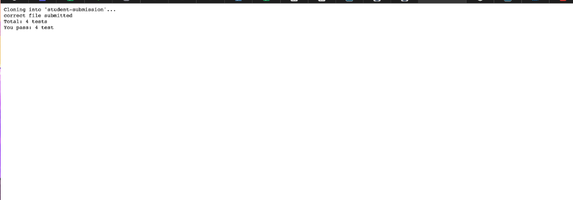
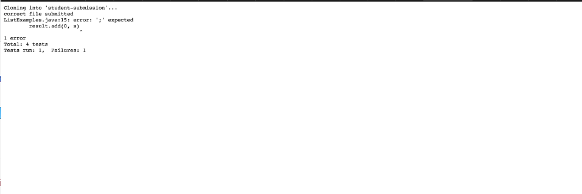

**grade.sh code**

    # Create your grading script here
    set -e
    CP = ".:lib/hamcrest-core-1.3.jar:lib/junit-4.13.2.jar"
    rm -rf student-submission
    git clone $1 student-submission 

    #check if file exist 
    if [[-f "./student-submission/ListExamples.java"]]
    then                            
        echo "Right file submitted!"

    else
        echo "Wrong file submitted!"
    fi

    cp TestListExamples.java ./student-submission/ > line17_out 2> line17_err
    cp -r lib ./student-submission/ > line18_out 2> line18_err
    set +e
    cd student submission > line20_out 2> line20_err

    javac -cp $CP *.java > line23_out 2> line23_err
    java -cp $CP org.junit.runner.JUnitCore TestListExamples 1> stdout 2> stderr

    CHECK = $(grep -o "Failures" stdout)
    P = $(grep -E -o ".{0,2}test.{0,0}" stdout)
    F = $(grep -E -o "Failures.{0,3}" stdout)

    if [[$CHECK]]
        then
                echo "Total: 4 tests"
                grep "F" stdout
        else
                echo "Total: 4 tests" 
                echo "Test pass: $P"
    fi
    echo $?
    if [[$? - eq 0]]
        then
                exit
        else
                echo "Test failed!"
    fi

**Three different student submission and reported grade**

1. https://github.com/ucsd-cse15l-f22/list-methods-corrected

    

2. https://github.com/ucsd-cse15l-f22/list-methods-compile-error

    

3. https://github.com/ucsd-cse15l-f22/list-methods-lab3

    

**Tracing one example from above**

*Example 1*

