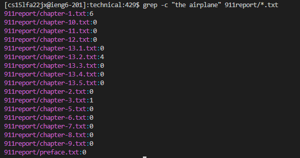

**Command: grep**

*Note: in technical directory already*

1. >-w

    
- Example 1: 

    >grep -w "Tuesday" 911report/*.txt 
    
    >

    The -w function search for the .txt files in the 911report that contain the word "Tuesday." It prints out the file name along with the surrounding texts of the word. This is useful as it's similar to ctrl+f on a pdf file. It helps us to find files that contain a specific word that we are looking for. 
    

- Example 2: 

    > grep -w "Information technology (IT) has become integral to providing" government/*/*.txt
    
    >
    
    The -w here search for .txt files in any of the subdirectories of the government directory that contain the given phrase. -w can search for files that containing the phrase rather than just a word. This is useful as if we are looking for a phrase, we don't have to look up one word from the phrase and then look through all the results trying to find which files contain the phrase. 

- Example 3: 

    > grep grep -w "the negative affect" */*.txt
    
    >

    The -w here look through all the .txt files in the technical directory and found no files contain the phrase "the negative affect." This help us to save time from needing to go through files after files just to see whether or not it contains the information we are looking for.

2. > -n

- Example 1: 

    >grep -n "Tuesday" 911report/*.txt
    
    >

    The -n looks for the .txt files in the the 911report directory that contains the string, "Tuesday," AND it list out the line number that the word is contained in. This is useful as not only does it help us to find the files that contain the information we want but also provided a direct place to look for it in the file. 

- Example 2: 

    >grep -n -w "Information technology (IT) has become integral to providing" government/*/*.txt
    
    >

    We can combine -n and -w. This will help us to look for .txt files in the subdirectories of the government dictory that contains the given phrase and provided the line number for where that phrase is located at in the file. This is useful as now we are able to find the exact spot of where to look at in the file for the information that is needed. 

- Example 3:

    >grep -n "the damage" government/*/*
    
    >

    the -n function here can also list out the line number in the files in the government's subdictories that contain the phrase "the damage" even without -w. The "" must be in use or else it will take in the command as look for lines that contain "the" and "damage" rather than lines that contain the word "the damage." It will be a long list of result that show the lines that contain words with the pattern "the" and "damage." This is useful in finding information needed, however, it is important to put "" even if it's a search for one word as a good habit to have. 

*Note: a good thing to know is that -n looks for word that is able to match the same pattern of the given string, it will still count those that has more than just the given pattern. Ex: damages will also be counted if the input is "damage"*

3. >-c

- Example 1: 

    >grep -c "FBI" 911report/*.txt
    
    >

    The -c here suppress the normal output where it print out the .txt files in the 911report dictory and the lines that contain the given string, "Tuesday," rather it counts the amount of time "Tuesday" is used in each of the .txt files in the 911report dictory. This is useful if we want to know how many time a word is used in the files. 

- Example 2: 

    >grep -c "the airplane" 911report/*.txt
    
    >

    The -c here print out the number of time the given phrase instead of just a single word occured in the .txt files in the 911report dictory. This is helpful as it's easier to look at compare to using -n or -w. So, in time where we just need to know whether or not the string or phrase are in the files of the dictory, we can just use -c to see the count and help us to get a number of how many time it's use rather having to count it ourselves. 

- Example 3: 

    > grep -c "human" biomed/*-2164-3-31.txt
    
    >

    The -c can also be used in just a single file rather than within a dictory. This will help to find the amount of time certain phrase or word is used in that specific file. The example here looked for the amount of time "human" is used in the specific file within the biomed dictory. This is helpful as it can work directly with a single file when in need. 

