**Part 1**

Task picked: 

    In DocSearchServer.java, change the name of the start parameter of getFiles, and all of its uses, to instead be called base.

Shortest Sequence of vim commands: 

1. `vim DocSearchServer.java`
2. `<Enter>`

    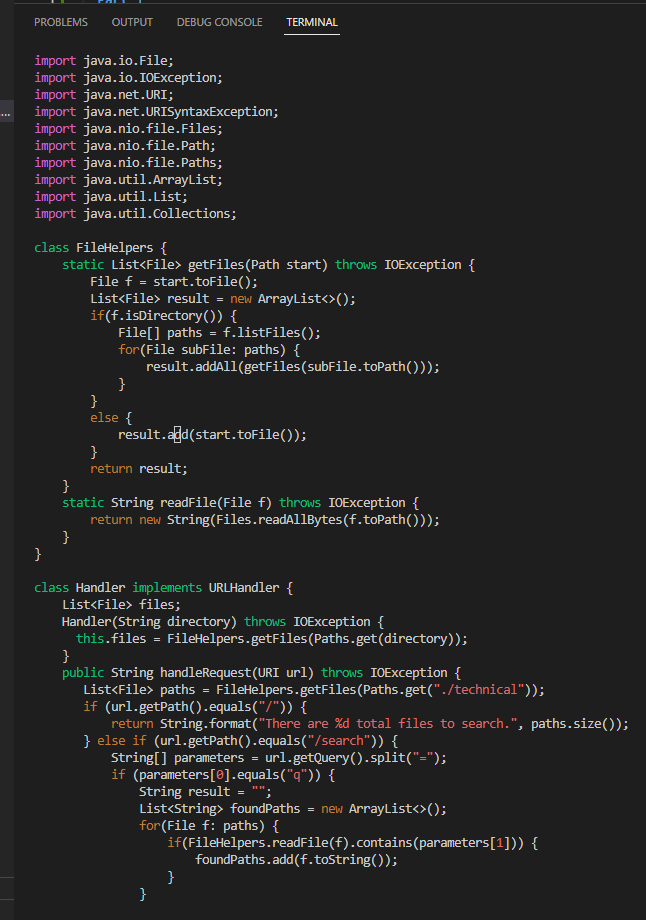
    
    This allow us to enter the DocSearchServer.java file in vim mode ready for edit 

3.  `/start` (6 keys pressed)

    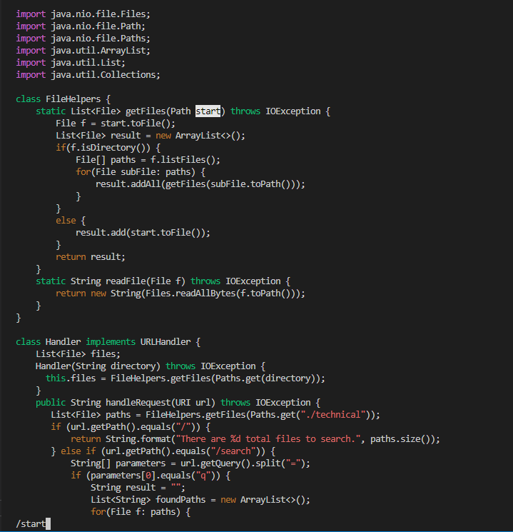
   
    This step help tp find the first "start" that is in the file that we need to change to be "base"

4. `<Enter>` (1 key pressed)

    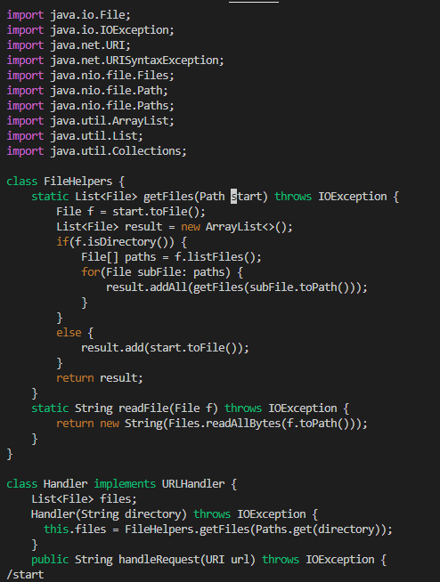
    
    After hitting enter, the cursor will automatically be at the begining of the word that we are trying to find

5. `dw` (2 keys pressed)

    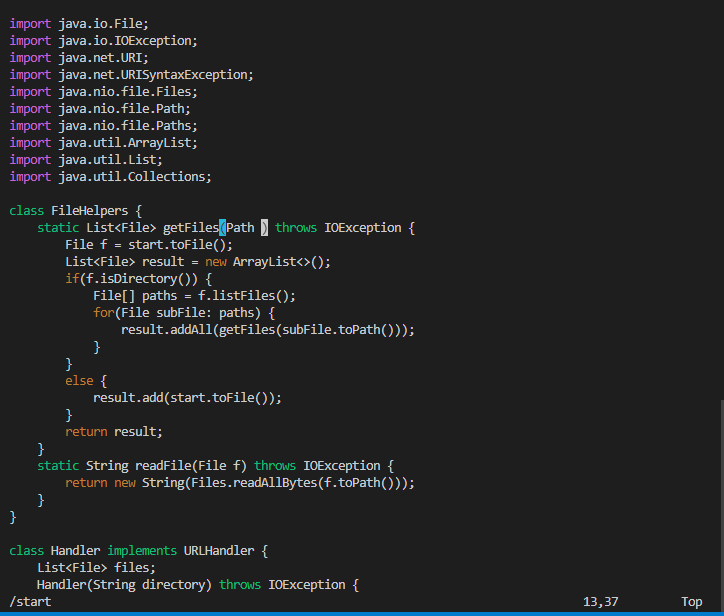
    
    `dw` will delete the whole word as the cursor was moved to the begining of "start" 

6. `i` (1 key pressed)

    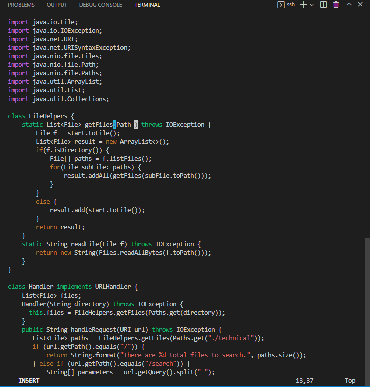
    
    pressing `i` will allow us to enter insert mode, allowing us to insert new word, such as "base", to replace the deleted word

7. type "base" 
8. `<Esc>` (1-key press)

    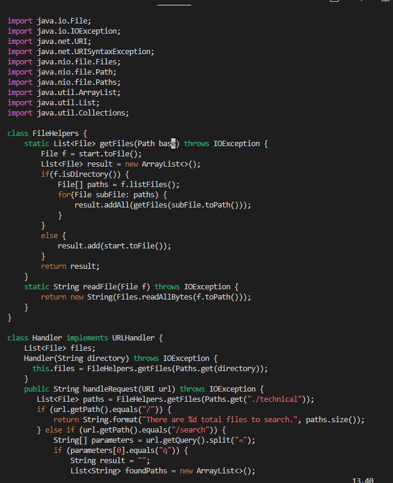
    
    type "base" as it's the desire word we want to replace "start" with then press esc will confirm the insert of the word while exiting out of insert mode 

9. `n` (1 key pressed)

    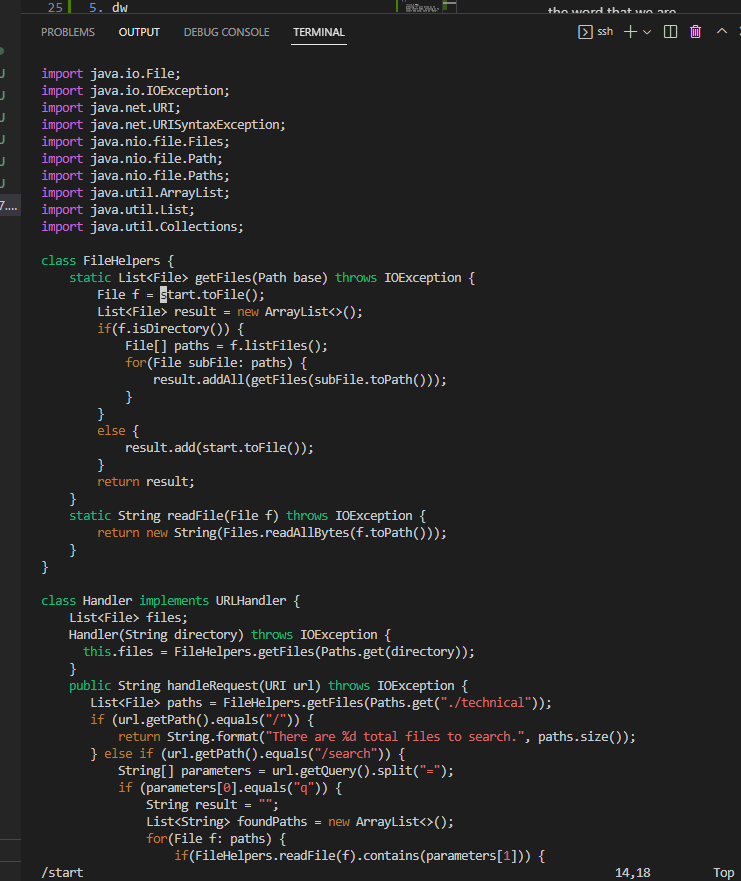
   
    pressing `n` repeat the same command that we did before, which is `/start` and it will jump to the next "start" that we need to edit 

10. repeat step 5 - 8 to change "start" to "base" again (`dw` > `i` > "base" > `<Esc>`)

    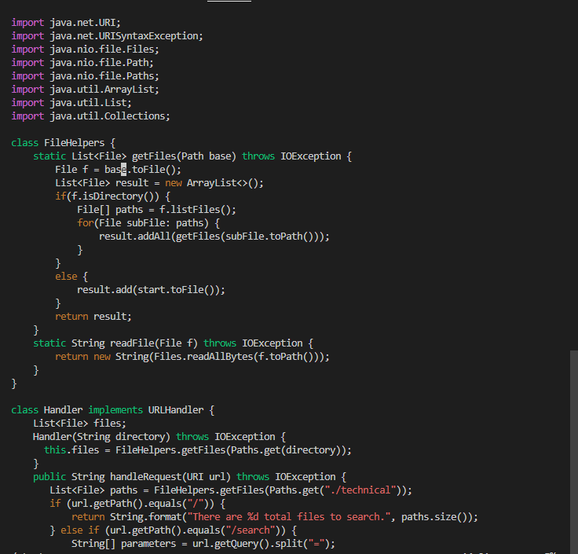
   
    (4 keys pressed)

11. `n` (1 key pressed)

    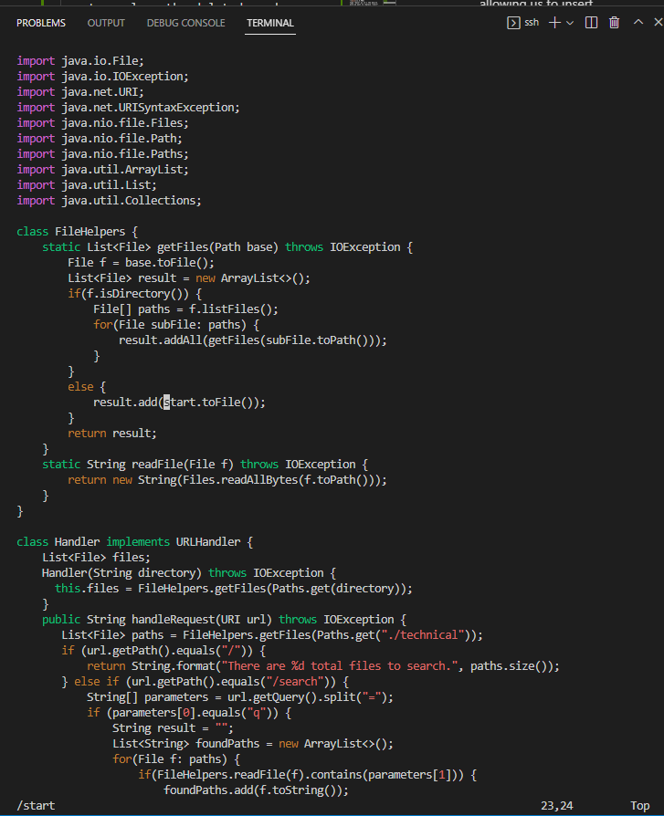
    
    Find the next "start" that needs to be change to "base" in the getFiles method 

12. repeat step 5 - 8 to change "start" to "base" again (`dw` > `i` > "base" > `<Esc>`)

    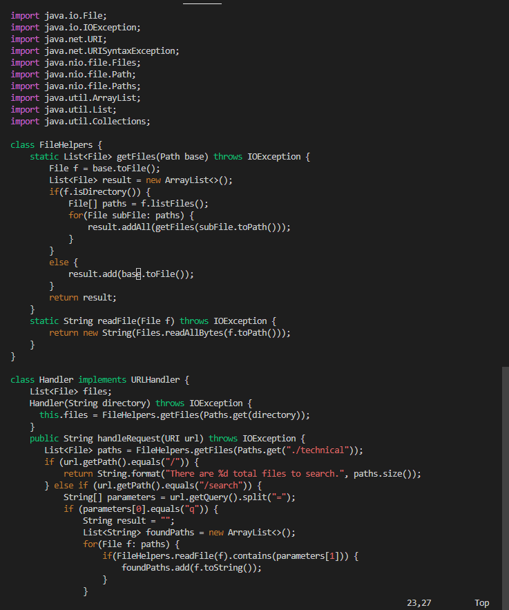
   
    (4 keys pressed)

13. `n` (1 key press)

    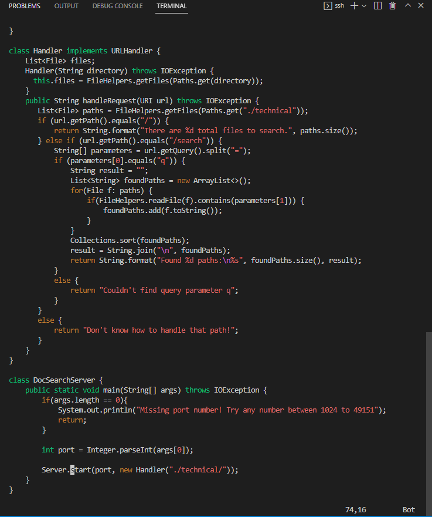
   
    It finds another "start" but this "start" is not in the getFiles method, hence, we don't need to change it to base. This mean that we have changed all the "start" in the getFiles method to "base" and our task is completed 

14. `:wq` (3 keys pressed)
15. `<Enter>` (1 key pressed)

    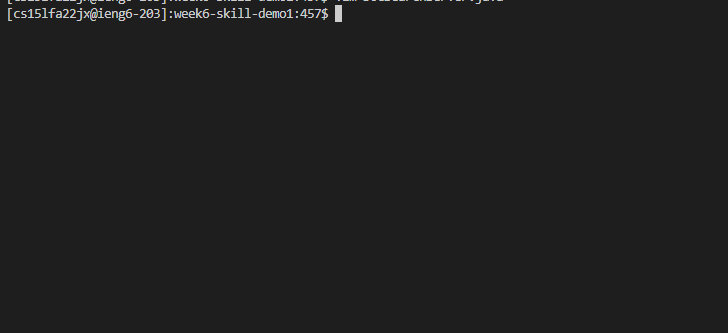
    
    `:wq` then `<Enter>` will save the changes on the files and exit out of vim 

**Total Key Pressed: 26 keys pressed for vim commands**

**Part 2**

1. 105 secs

    Diffculties: 
    - It was harder to find every "start" that needs to be change to "base" and make sure I didn't miss any of it. 
    - Ran bash forgetting to cd into the folder and directory that contained the files and did it on home directory right after ssh
    

2. 53 secs 

    Diffculties: 
    - making sure in insert mode before typing 

Questions: 

1. If I had to work on a program remotely, I would prefer using the second method where I had already log into ssh and make the edit in Vim. This is because vim has a lot of commands that help to make the process easier and more efficent. In vim, I don't have to relay on my own to search for words that need to be change. It also has a command to repeat the earlier command, which mean more time effcient. Furthermore, once I finish the editing, I can just exit vim and run the test rather having to scp then ssh then cd to the folder and directory to run the test. Scp and ssh takes away a lot of time and typos can easily occur causing things to go slower. 

2. I don't think anything would affect my decision. This is because as far as I have work with vim, it has showed that it's more efficient for editing files compare to doing it locally then sending it to remote. Its features allow less msitake and less typing. The fact that I can repeat command and use tools rather than my own ability to do task makes it more reliable. This is because if I'm doing it without vim and the project require looking over thousand lines of code, then I think I will be lost before I can even finish the task. 