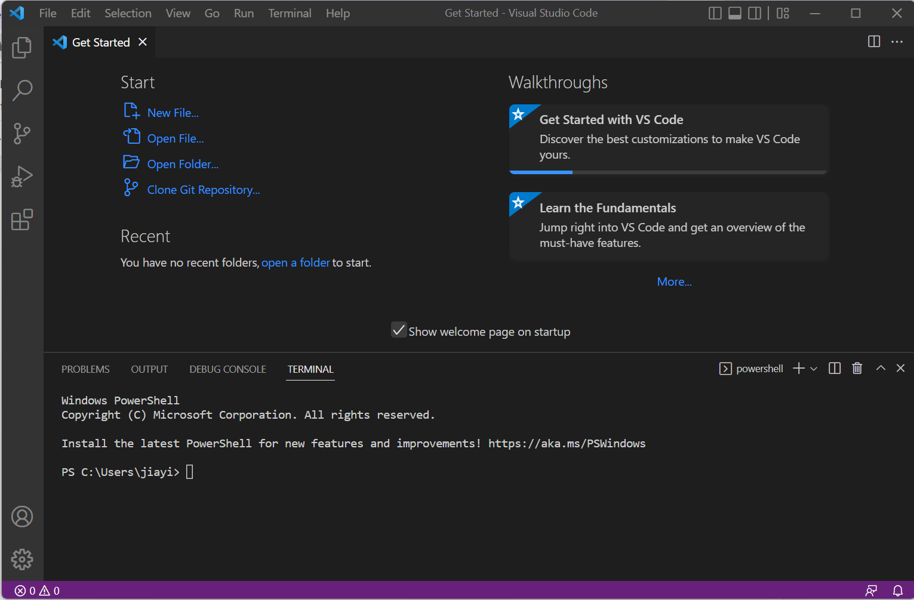
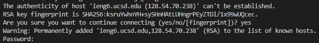
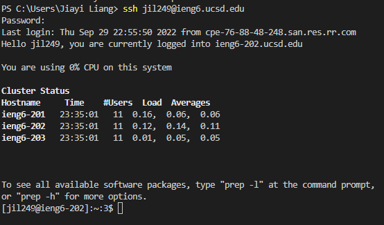
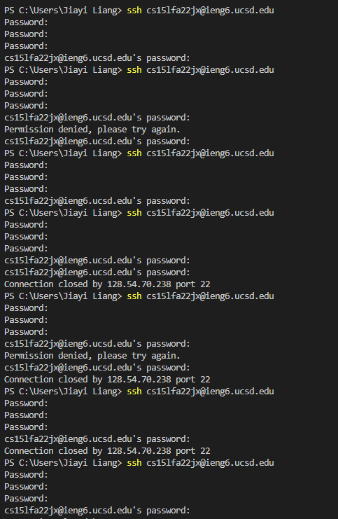
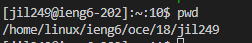
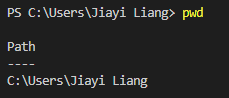
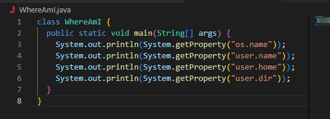
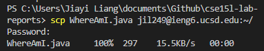
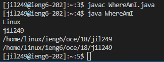
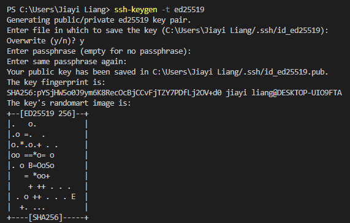

**Step 1: Installing VScode**
- goes to [VScode](https://code.visualstudio.com/) to download the software onto your device 
- There are different versions based on the what operating systes you are using, make sure you pick the right one 
- When it's downloaded, the page should look like the picture below 
    

**Step 2: Remotely Connecting**
- Open a new terminal in VScode by using the dropdown menu from "Terminal" 
- type in the command as follow but instead of jx, use the letters in your own course-specific account
> $ ssh cs15lfa22jx@ieng6.ucsd.edu
- The following message will pop up if it's the first time. Just go ahead and say yes to it just as follow. Then log in by using the passcode you created in [Resetting Password](https://sdacs.ucsd.edu/~icc/index.php)

     
- Once login, these informations will pop up 

    
- **Note**: My login is not cse15lfa22jx@ieng6.ucsd.edu as it should be because it's not working as can be seen in the following failed attempts. So, I had to use my AD login for this lab. 

    

**Step 3: Trying Some Commands**
- Now that we are in the remote computer, we can test out some commands to see the difference when running it on the remote vs. physical device 
- I run the command pwd on both the remote and physical device here is the two results.
    
    **remote device**: 
    
    

    **physical device**: 
    
    

    The usernames are different and the directory are also different. This make sense as they are both two different devices. 

**Step 4: Moving Files with scp**
- Create a new file name "WhereAmI.java" on your own device and include the code as follow in the file

    

- Since I don't have java install on my device, I skip the printint out WhereAmI.java on my device 
- use the following code to copy the WhereAmI.java over to the remote device 
>scp WhereAmI.java jil249@ieng6.ucsd.edu:~/ 
- If it's done correctly, it should look like the following picture 

    

- On youre remote device, use the following code to run the command from WhereAmI.java
>javac WhereAmI.java

>java WhereAmI

- If you have java install on your physical device, the result will be different compare to the one outputed in the remote device. This is because the username, operating system, and user directory are all different on the two different devices. 

    

**Step 5: Setting an SSH Key**
- On the client (your own device) type in the following code and press enter until your screen look as follow 
> ssh-keygen -t ed25519

 

My device is a widow, which is why I use the window user step rather than the one for Mac users. 

- On the server, type in the following code 
>mkdir .ssh

- Then, back to the client and type in the following code
>scp 

**Step 6: Optimizing Remote Running**