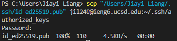
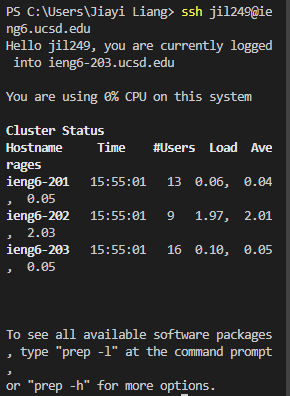
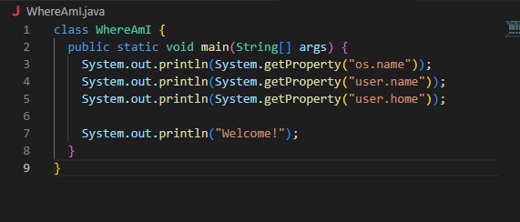
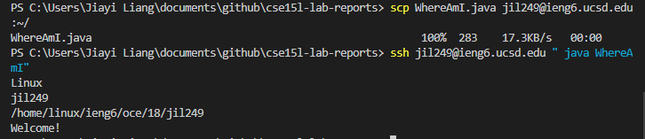

**Step 1: Installing VScode**
- goes to [VScode](https://code.visualstudio.com/) to download the software onto your device 
- There are different versions based on the what operating systes you are using, make sure you pick the right one 
- When it's downloaded, the page should look like the picture below 
    

**Step 2: Remotely Connecting**
- Open a new terminal in VScode by using the dropdown menu from "Terminal" 
- type in the command as follow but instead of jx, use the letters in your own course-specific account
    > $ ssh cs15lfa22jx@ieng6.ucsd.edu
- The following message will pop up if it's the first time. Just go ahead and say yes to it just as follow. Then log in by using the passcode you created in [Resetting Password](https://sdacs.ucsd.edu/~icc/index.php)

     
- Once login, these informations will pop up 

    
- **Note**: My login is not cse15lfa22jx@ieng6.ucsd.edu as it should be because it's not working as can be seen in the following failed attempts. So, I had to use my AD login for this lab. 

    

**Step 3: Trying Some Commands**
- Now that we are in the remote computer, we can test out some commands to see the difference when running it on the remote vs. physical device 
- I run the command pwd on both the remote and physical device here is the two results
    
    **remote device**: 
    
    

    **physical device**: 
    
    

    **Note**: The usernames are different and the directory are also different. This make sense as they are both two different devices. 

**Step 4: Moving Files with scp**
- Create a new file name "WhereAmI.java" on your own device and include the code as follow in the file

    

- Since I don't have java install on my device, I skip the printint out WhereAmI.java on my device 
- use the following code to copy the WhereAmI.java over to the remote device 
    >scp WhereAmI.java jil249@ieng6.ucsd.edu:~/ 
- If it's done correctly, it should look like the following picture 

    

- On youre remote device, use the following code to run the command from WhereAmI.java
    >javac WhereAmI.java

    >java WhereAmI

- If you have java install on your physical device, the result will be different compare to the one outputed in the remote device. This is because the username, operating system, and user directory are all different on the two different devices 

    

**Step 5: Setting an SSH Key**
- On the client (your own device) type in the following code and press enter until your screen look as follow 
    > ssh-keygen -t ed25519

    

My device is a widow, which is why I use the window user step rather than the one for Mac users. 

- On the server, type in the following code 
    >mkdir .ssh

- Then, back to the client and type in the following code
    >scp "/Users/Jiayi Liang/.ssh/id_ed25519.pub" jil249@ieng6.ucsd.edu:~/.ssh/authorized_keys

    **Note**: Disregard the quotation if your username has no space. If your username has a space like, "Jiayi Liang," then make sure to put the commend in quotation like above. I learned from a classmate that computer REALLY hate space and without the quotation, the command will not work.

- The following message will pop up if it's copied successfully to the remote computer 

    

- Now, we can log in into the remote computer without needing to type in our password as shown below. This will save us time when it comes to changing commend and copying over to the remote computer 

    

**Step 6: Optimizing Remote Running**
- Using what we learned, I first made some changes to the WhereAmI.java file on my device as follow 

    

- I then use the following two command to copy and run the WhereAmI.java on the remote device 

    
- This requires more than 10 keystrokes for the total time of a run after editing and saving 
- The best process that I can come up with is to 

    1. use the arrow key twice and enter key once to run the scp command after a edit and save 
    2. use the arrow key twice again to get the ssh commend and then enter key once for the WhereAmI.java file to run on the remote computer 

    **Note**: Though, this require scp and ssh commend to be previously typed once. This will make the edit and running work faster but doesn't make the first run faster as you will have to type out the scp and ssh commend first. 
