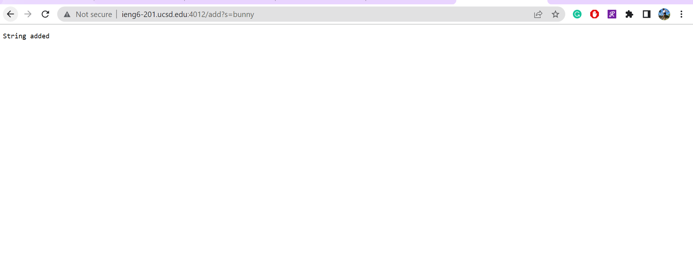
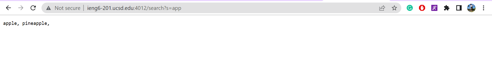

**Part 1**

This is my Simplest Search Engine from week 2:

    import java.io.IOException;
    import java.net.URI;
    import java.util.*;

    class Handler implements URLHandler {
        // The one bit of state on the server: a number that will be manipulated by
        // various requests.
        int num = 0;
        List<String> str = new ArrayList<String>();

        public String handleRequest(URI url) {
            if (url.getPath().equals("/")) {
                return String.format("Number: %d", num);
            } else if (url.getPath().equals("/increment")) {
                num += 1;
                return String.format("Number incremented!");
            } else {
             System.out.println("Path: " + url.getPath());
                if (url.getPath().contains("/add")) {
                    String[] parameters = url.getQuery().split("=");
                    if (parameters[0].equals("count")) {
                        num += Integer.parseInt(parameters[1]);
                        return String.format("Number increased by %s! It's now %d", parameters[1], num);
                    }
                    else if (parameters[0].equals("s")){
                        str.add(parameters[1]);
                        return String.format("String added");
                    }
                }
                else if(url.getPath().contains("/search")){
                    String templist = "";
                    String [] parameters = url.getQuery().split("=");
                    if(parameters[0].equals("s")){
                        for(int i = 0; i< str.size(); i++){
                            if(str.get(i).contains(parameters[1])){
                                templist = templist + str.get(i) + ", ";
                            }
                        }
                    }
                }
                return "404 Not Found!";
            }
        }
    }

    class SearchEngine {
        public static void main(String[] args) throws IOException {
            if(args.length == 0){
                System.out.println("Missing port number! Try any number between 1024 to 49151");
                return;
            }

            int port = Integer.parseInt(args[0]);

            Server.start(port, new Handler());
        }
    }

Screenshot 1: 

    
- method called: /add()

- values of the relevant arguments: bunny

- values of any relevant fields of the class: 

        if (url.getPath().contains("/add")) 

- how does values change by the time the request is done processing: 

    By the time the request is done processing, the value fo the relevant argument is added to the string and "String added!" is return.

Screenshot 2: 

    
- method called: /search()

- values of the relevant arguments: app

- values of any relevant fields of the class: 

         else if(url.getPath().contains("/search"))

- how does values change by the time the request is done processing: 

    By the time the request is done processing, a list that contains the string that has the input value will be returned and be display. 

Screenshot 3: 

    
- method called: none

- values of the relevant arguments: bo

- values of any relevant fields of the class: none

- how does values change by the time the request is done processing: 

    After the request is done processing, the code ran through all the methods trying to find the one for find, in which it realizes that /find doesn't fit in any of the requirement, hence, it returned "404 Not Found" which will be return if there is no method to process /find.

**Part 2**

Bug #1: reverseInPlace() from ArrayExamples.java
    
- The failure-inducing input: 

    

- The symptom: 
    
    The expected outcome is {3, 6, 7} but it came out to be {3, 6, 3}. The value of the third index was not correctly assigned in the outcome

- The bug:

    
    When i = 2, arr[2]=arr[0], but it's assigning the value from index 0 from the original array but the value that's in the new array. So, the original value for index[0] is lost and the code used the new value for index[0] after it's already been reversed.

- Connection between the symptom and the bug:

    The bug caused the value of the index[2] to be assigned by the value in index[0] of the reversed array rather than the original, which is why the symptom displays {3, 6, 3} rather than {3, 6, 7}. The value of the last index was assigned index[0] of the new array, 3, rather than the value of index[0] from the original array, which is 7. 

Bug #2: merge() from ListExamples.java
- The failure-inducing input:

    

- The symptom:

    The expected outcome is {bunny, boba, cat, dog, flower} but the code is stuck in an infinite while loop. 

- The bug:

    
    When the code is adding the left over elements from list2, the increment index is 1 rather than 2, which caused it to stuck in a loop 

- Connection between the symptom and the bug: 

     The bug caused the symptom as the wrong increment caused the code to be stuck in a loop rather than merging the two lists together and getting it printed out.
