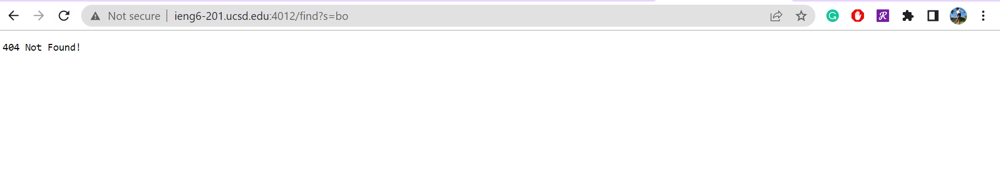

**Part 1**

This is my Simplest Search Engine from week 2:

    import java.io.IOException;
    import java.net.URI;
    import java.util.*;

    class Handler implements URLHandler {
        // The one bit of state on the server: a number that will be manipulated by
        // various requests.
        int num = 0;
        List<String> str = new ArrayList<String>();

        public String handleRequest(URI url) {
            if (url.getPath().equals("/")) {
                return String.format("Number: %d", num);
            } else if (url.getPath().equals("/increment")) {
                num += 1;
                return String.format("Number incremented!");
            } else {
             System.out.println("Path: " + url.getPath());
                if (url.getPath().contains("/add")) {
                    String[] parameters = url.getQuery().split("=");
                    if (parameters[0].equals("count")) {
                        num += Integer.parseInt(parameters[1]);
                        return String.format("Number increased by %s! It's now %d", parameters[1], num);
                    }
                    else if (parameters[0].equals("s")){
                        str.add(parameters[1]);
                        return String.format("String added");
                    }
                }
                else if(url.getPath().contains("/search")){
                    String templist = "";
                    String [] parameters = url.getQuery().split("=");
                    if(parameters[0].equals("s")){
                        for(int i = 0; i< str.size(); i++){
                            if(str.get(i).contains(parameters[1])){
                                templist = templist + str.get(i) + ", ";
                            }
                        }
                    }
                }
                return "404 Not Found!";
            }
        }
    }

    class SearchEngine {
        public static void main(String[] args) throws IOException {
            if(args.length == 0){
                System.out.println("Missing port number! Try any number between 1024 to 49151");
                return;
            }

            int port = Integer.parseInt(args[0]);

            Server.start(port, new Handler());
        }
    }

**Screenshot 1:** 

    
- method called: handleRequest - /add()

- values of the relevant arguments: bunny

- values of any relevant fields of the class: 

    - url.getPath() has value /add
    - url.getPath().contains("/add") has value true 
    - url.getQuerry() has value ?s=bunny
    - parameters[0] has value s
        parameters[1] has value bunny 

- how does values change by the time the request is done processing: 

    As the request is processing, the method will check if there is a path after **/**. In which there is a **/add** and so the value of **url.getPath()** is going to be **/add** and the value for **url.getPath().contains("/add")** is true. Then, **url.getQuery()** will be **?=bunny** and it will split it at **=** then check whether or not **parameters[0].equals("s")** will return true which it will. So, it will then add **parameters[1]** to the list which is bunny. These values will remain the same until the new request because the server will continue to run waiting for new request until **ctrl + c**.

**Screenshot 2:** 

    
- method called: handleRequest - /search()

- values of the relevant arguments: app

- values of any relevant fields of the class: 

    - url.getPath() has value /search
    - url.getPath().contains("/search") is true 
    - url.getQuerry() has value ?s=app
    - parameters[0] has value s
    - parameters[1] has value app 
    - templist has both value apple and pinapple 

- how does values change by the time the request is done processing: 

    As the request is processing, the method will check if there is a path after **/**. In which there is a **/search** and so the value of **url.getPath()** is going to be **/search** and the value for **url.getPath().contains("/search")** is true. Then, **url.getQuery()** will be **?=app** and it will split it at **=** then check whether or not **parameters[0].equals("s")** will return true which it will. Then, **parameters[1]** is **app**. The String List **templist** will contain both **apple** and **pineapple** because they both contains **app**. These values will remain the same until the new request because the server will continue to run waiting for new request until **ctrl + c**.

**Screenshot 3:** 

    
- method called: handleRequest

- values of the relevant arguments: bo

- values of any relevant fields of the class: 

    - url.getPath() has value /find
    - url.getPath().contains("/search") is false
    - url.getPath().contains("/add") is false 

- how does values change by the time the request is done processing: 

    As the request is processing, the method will check if there is a path after **/**. In which there is a **/find** and so the value of **url.getPath()** is going to be **/find**, though, it doesn't match any of the values of the relevant fields of the class. It will go from the if statement down to else if to else to else if and else if again then run into the fact that none of the url.getPath().contains() to be true nor does it equals to ("/increment"). Hence, it doesn;t match any of the method and will only reutrn "404 Not Found!" These values will remain the same until the new request because the server will continue to run waiting for new request until **ctrl + c**.

**Note:** I ran the SearchEngine.java on the remote computer because I didn't have java downloaded on my device at that time. 

**Part 2**

Bug #1: reverseInPlace() from ArrayExamples.java
    
- The failure-inducing input: 

    

- The symptom: 
    
    The expected outcome is {3, 6, 7} but it came out to be {3, 6, 3}. The value of the third index was not correctly assigned in the outcome

- The bug:

    
    When i = 2, arr[2]=arr[0], but it's assigning the value from index 0 from the original array but the value that's in the new array. So, the original value for index[0] is lost and the code used the new value for index[0] after it's already been reversed.

- Fixing the Bug: 

    
    I created a tempArray to temporary store the reversed array so the function won't be using the reversed array to do the work. This time, it will reverse the value from the original array rather than using the value from the newly reversed array which caused a lost of value at the result. 

- Connection between the symptom and the bug:

    The bug caused the value of the index[2] to be assigned by the value in index[0] of the reversed array rather than the original, which is why the symptom displays {3, 6, 3} rather than {3, 6, 7}. The value of the last index was assigned index[0] of the new array, 3, rather than the value of index[0] from the original array, which is 7. This is because the code originlal has **arr[i]=arr[arr.length-i-1];** which is assigning the value from the reversed array to the reversed array rather than assigning the value from the orriginal array to the reversed array. This is an issue because it caused a lost of value during the process and the array is not correctly reversed. The original value of index[0], 7, is now gone and replaced by the new value 3 from index[2] from the original array after being reversed is now used again for index[2] of the newly reversed array rather than using 7.

Bug #2: merge() from ListExamples.java
- The failure-inducing input:

    

- The symptom:

    The expected outcome is {bunny, boba, cat, dog, flower} but the code is stuck in an infinite while loop. 

- The bug:

    
    When the code is adding the left over elements from list2, the increment index is 1 rather than 2, which caused it to stuck in a loop 

- Fixing the bug: 

    
    I changed **index1** to **index2** so the increment index is 2 rather than 1 and the process can move down the list to merge the list together rather than suck at incrementing 1 and having **index2** less than **list2.size**

- Connection between the symptom and the bug: 

     The bug caused the symptom as the wrong increment caused the code to be stuck in a loop rather than merging the two lists together and getting it printed out. This is because the code just increment index1 which goes to index2, then index2 is less than list2.size, then it will go through the resul.add but instead of moving down the line from index2 to index3, the code once again move from index1 to index2 which is already done and will never end because index2 will always be less than list2.size. The list will never be merge toegther but stuck in an infinite loop as the code is stuck between going from index1 to index2 and adding index2 to the list. This caused the infinte loop rather than merging the list together. 
